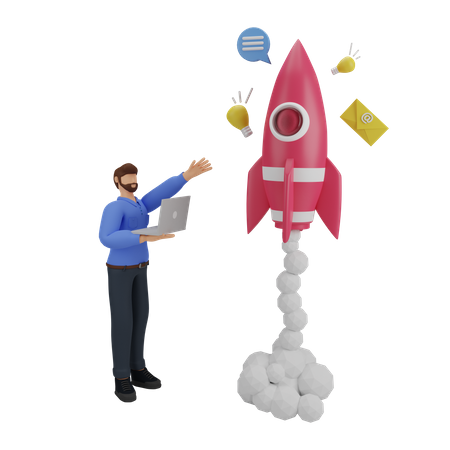

 
## Olá eu sou o João Keuwe! 👋👨🏾‍💻
### 🔭Quem sou eu?
### ♋ 21 Anos
### 👨🏾‍💻 Desenvolvedor Front-end Jr
### 🎮 Amante de games
### 📚 Adoro ler livros sobre tecnologias  e desenvolvimento pessoal
### 🎨 Veja mais de meus projetos em meus [Repositórios](https://github.com/JoaoKeuwe?tab=repositories)
### 📚 Acesse meu [Portifólio](https://portifoliokeuwe.netlify.app/)

 

##

<a href="https://github.com/JoaoKeuwe">

 

##

## Tecnologias que uso no meu dia a dia 🧑🏾‍💻
 

 

## Tecnologias que estou estudando no momento 👨🏾‍💻

 
 
 

  
 
 
 
 

  
# Ultimos Projetos 🌍
  
 

## [Projeto keuwe gym Website](https://gym-website-pi.vercel.app/) 🏋🏾
## [Calculadora Dark & Light Mode](https://calculatorkeuwe.netlify.app) ☀️🌙
## [Projeto Agency JK](https://keuweagency.netlify.app) 👨🏾‍💼  

## [Projeto Imobiliária Versace Home](https://imobiliariakeuwe.netlify.app) 🏠
## [Blog](https://keuweblog.netlify.app/) 📰
## [Portifólio Pessoal](https://portifoliokeuwe.netlify.app) 🖼️
## [Jogo da velha Neon](https://tourmaline-praline-a4cf56.netlify.app) 🌀
## [Projeto Keuwe Tunes](https://keuwe-tunes.netlify.app) 🎶
## [Todo-List](https://keuwetodolist.netlify.app/) 🗒️
## [Projeto Buscador de CEP](https://busca-de-cep.netlify.app) 🚩
## [Landing Page Tesla](https://landing-page-tesla.netlify.app) 🚗
## [Projeto Keuwe Gallery](https://keuwegalery.netlify.app/) 📸
## [Forms Twitter](https://teal-monstera-8600c4.netlify.app) 🕊️
## [Landing Page Starbucks](https://landing-page-starbuckss.netlify.app) ☕

