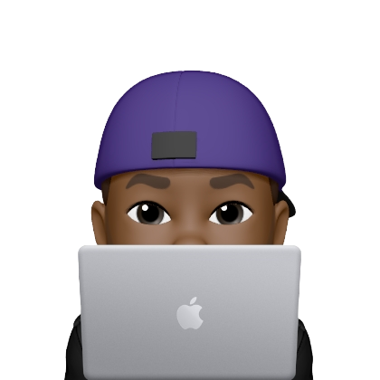
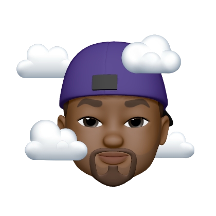
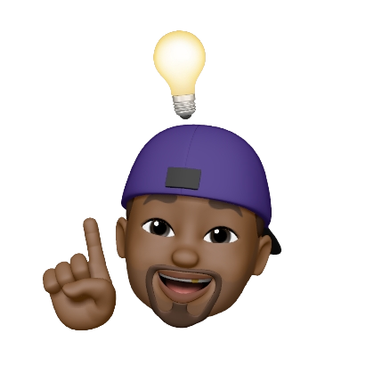

[](https://git.io/typing-svg)
 
<div align=left>
 
## Olá eu sou o João Keuwe! 👋👨🏾‍💻
### 🔭Quem sou eu?
### ♋ 22 Anos 
### 👨🏾‍💻 Desenvolvedor Front-end Jr
### 🎮 Amante de games
### 📚 Adoro ler livros sobre tecnologias  e desenvolvimento pessoal
### 🎨 Veja mais de meus projetos em meus [Repositórios](https://github.com/JoaoKeuwe?tab=repositories)
### 📚 Acesse meu [Portifólio](https://keuweportifolio.netlify.app/)
### 📲 Meu [Linkedin](https://www.linkedin.com/in/joaokeuwe/)
 

</div> 

##

<div>
<a href="https://github.com/JoaoKeuwe">

 ```javascript
const express = require('express')
const app = express()

const webDeveloper = {name:"Joao-Keuwe", stack:"Front-End-Developer"}

app.get('/', (req, res) =>{
  return res.send(webDeveloper)
}),

app.listen(3000, () =>{
  console.log("Initing code...")
})


```

</div> 

##

</div>
<div>
 




</div>
 
## Tecnologias que uso no meu dia a dia 🧑🏾‍💻
 
[](https://skillicons.dev)


<br>

## Tecnologias que estou estudando no momento 👨🏾‍💻


<br>
<br>
<br>

[](https://skillicons.dev) <br>
<br>
<br>
<br>
<br>
<div align=center>
  
# Ultimos Projetos 🌍
   
</div>


<div align=left>

## [Portifólio web](https://portifolio-keuwe.vercel.app/) 👨🏾‍💻
## [Projeto keuwe gym Website](https://gym-website-pi.vercel.app/) 🏋🏾
## [Calculadora Dark & Light Mode](https://calculator-dark-and-light-mode.vercel.app/) ☀️🌙
## [Landing Page Bored Cat](https://landing-page-bored-cat-qis4.vercel.app/) 🐈


## [Projeto Agency JK](https://project-software-agency.vercel.app/) 👨🏾‍💼
## [Landing Page astronault](https://landing-page-b8ah.vercel.app/)🧑‍🚀 
## [Projeto Imobiliária Versace Home](https://projeto-imobiliaria-sand.vercel.app/) 🏠
## [Blog](https://project-keuwe-blog.vercel.app/) 📰
## [Mini Portifólio](https://portifoliokeuwe.vercel.app/) 🖼️
## [Jogo da velha Neon](https://tourmaline-praline-a4cf56.netlify.app) 🌀
## [Projeto Keuwe Tunes](https://keuwe-tunes.netlify.app) 🎶
## [Todo-List](https://project-todo-list-blush.vercel.app/) 🗒️
## [Projeto Buscador de CEP](https://teste-kivid.vercel.app/) 🚩
## [Landing Page Tesla](https://landing-page-bored-cat.vercel.app/) 🚗
## [Projeto Keuwe Gallery](https://keuwegallery.vercel.app/) 📸
## [Forms Twitter](https://forms-twitter.vercel.app/) 🕊️
## [Landing Page Starbucks](https://landing-page-starbucks-seven.vercel.app/) ☕

</div>
